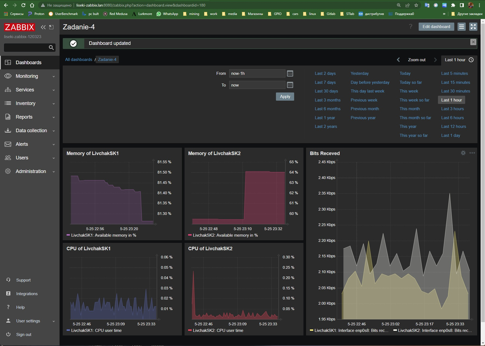

# Домашнее задание к занятию "`9-03hw`" - `Ливчак Сергей`
---

### Задание 1

`Создайте свой шаблон, в котором будут элементы данных, мониторящие загрузку CPU и RAM хоста.`

1. Создаю группу шаблонов чтобы было легче искать "slaviki"
2. Создаю Template "Zadanie-1"
3. Добавляю Items - Вводим название, выбираем ключ, указываем интервал

**Скриншот 1-1_1**

### Задание 2-3

`1)Добавьте в Zabbix два хоста и задайте им имена`
`2)Привяжите созданный шаблон к двум хостам. Также привяжите к обоим хостам шаблон Linux by Zabbix Agent.`

1. Установил и задал настроки хостов ещё в прошлом задании, в Latest Data поток идёт
2. Привязываю шаблоны к хостам

**Скриншот 3-1_1**

### Задание 4

`Создайте свой кастомный дашборд.`

1. Задал графики для параметров интересующих меня

**Скриншот 4-1_1**
